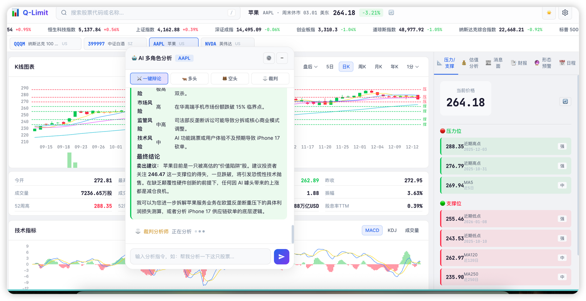
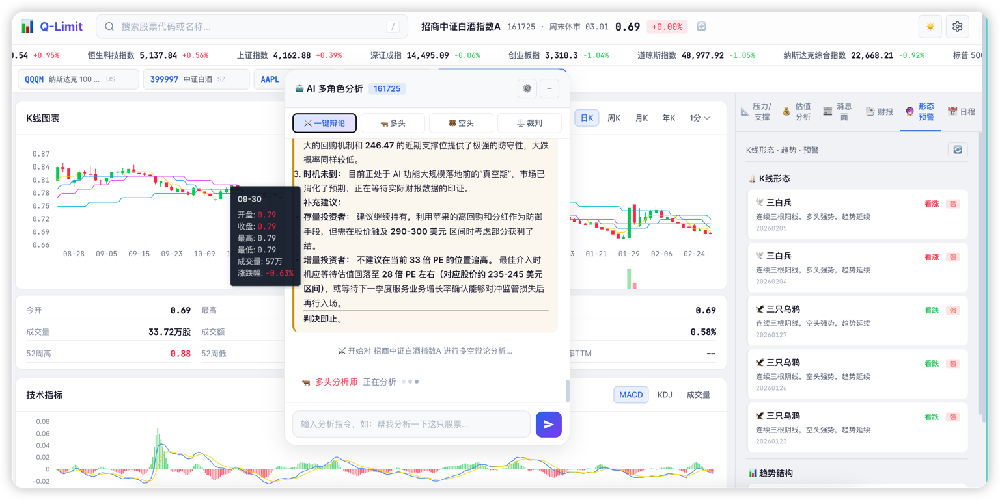

# Q-Limit 📈

**Q-Limit** 是一套现代化、高效的开源股票行情分析与 AI 多角色辅助决策系统。它融合了实时行情跟踪、全维度的技术/财务/估值分析，以及特色鲜明的**多阵营 AI 同台辩论**功能，致力于为投资者提供客观、深度的市场分析工具。

> 🤖 **关于本项目：** 本项目的前端渲染、后端架构设计及所有的 API 整合均在用户的自然语言设想下，由 AI 全程作为辅助协同开发生成。这既是一个实用的股票分析平台，也是 Agentic AI 在复杂全栈金融项目中落地的一个概念验证（PoC）。




## ✨ 核心特性

- **🌍 纯净前端大模型接入**：支持纯对话类 LLM 原生接入。无需复杂的 Function Calling 支持，系统会自动进行**上下文注入**，把股票最新资金、技术指标和新闻在后台查询并拼装喂给 AI，令聊天机器人瞬间拥有了真实世界的金融分析能力！
- **⚔️ 首创 AI 多空辩论场**：
  - 🐂 **多头分析师**：专注于挖掘潜在的各种利好和上涨趋势。
  - 🐻 **空头分析师**：如同达摩克利斯之剑，负责警示估值泡沫、揭示潜藏的各类风险。
  - ⚖️ **裁判员**：根据多空双方的论据进行客观复盘，最终给出现实可行的做单建议。
- **📊 全维度面板看板**：
  - K线绘制（日线、分钟线图表结合技术指标）
  - 面板集成：盘口报价、估值水温分析、技术形态监测、新闻热榜。
- **⚙️ 隐私友好的纯前端配置**：各大 AI 模型的 API Key 及 Base URL 配置全部由用户浏览器 localStorage 纯本地保存，彻底规避服务端数据泄露风险。

---

## 🚀 快速开始

本项目后端采用轻量级的 **Python Flask** 构建，依赖简单，启动极速。

### 1. 环境准备

请确保系统已安装：
- Python 3.8+
- [MongoDB](https://www.mongodb.com/) (本地服务或云实例)

### 2. 获取代码与安装依赖

```bash
git clone https://github.com/zhaoboy9692/Q-Limit.git
cd Q-Limit

# 建议使用虚拟环境
python3 -m venv venv
source venv/bin/activate  # Windows 用户使用 venv\Scripts\activate

# 安装依赖
pip install -r requirements.txt
```

### 3. 配置数据库与启动

项目使用 MongoDB 作为本地缓存（K线、API频控等），确保 Mongo 已启动。
可以在项目中检查 `config.py` 的 MongoDB 设定，默认连接 `mongodb://localhost:27017`。

**启动后端服务器：**
```bash
python3 app.py
```
> 服务器默认将在 `http://127.0.0.1:5001` 启动。

### 4. 配置 AI 模型

系统启动后，在浏览器访问 `http://127.0.0.1:5001`。
1. 点击右上角 **"⚙️ 设置"** 图标，打开全局设置面板。
2. 切换到 **“🤖 AI 模型配置”** 页签。
3. 针对“多头”、“空头”和“裁判”分别填入您的第三方或原生模型代理信息（如：Base URL, API Key, Model名称）。支持所有接轨于 OpenAI `/v1/chat/completions` 标准格式的中转接口。

---

## 🛠 技术架构

- **后端层**：Flask + Requests + PyMongo。主要负责承接前端数据、通过各种聚合行情接口查数据，拼接并转发 SSE 流式请求给第三方 AI。
- **数据层**：利用 MongoDB 进行轻量级请求频率限制与 K线走势重计算的落盘缓存。
- **前端层**：Vanilla JS + CSS 变量定制系统 + ECharts K线渲染引擎，全程单页面交互体验 (SPA)，UI 现代且自带优雅的 Dark Mode。

---

## 📖 使用指南

- **搜索与自选**：在上方搜索框键入想要分析的股票代码（如 `AAPL`），可以直接获取。也可以添加到左侧自选股列表。
- **一键辩论**：点击右侧聊天面板中的“一键辩论”。此时后端会自动抓取各项财务与技术因子，并组织三位AI进行轮番辩论。
- **单独交流**：点击下方的“🐂多头”或“🐻空头”头像，也可以单独针对他们所在的立场提出有关特定财务指标、近期事件的垂直提问。

---


## 📄 开源协议

本项目基于 [GPL-3.0 License](LICENSE) 协议开源。请注意，所有的股票接口与 AI 对话结果仅供开发与学习参考，**不能作为任何真实的投资或交易建议**。市场有风险，投资需谨慎。
